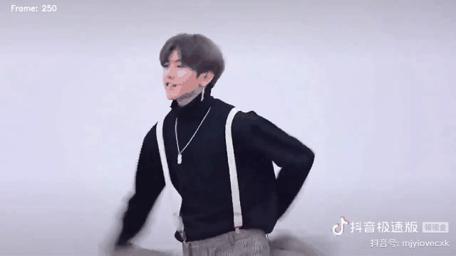

# Basketball Detection

一个基于 OpenCV 的篮球颜色检测项目。程序通过 HSV 和 RGB 阈值提取篮球区域，并使用方框标记检测结果。

## 效果预览



## 文件说明

- `src/1.py`：调参工具。打开视频后，可以使用 Trackbar 调整 HSV 或 RGB 参数，并按 `A/D` 切换前后帧。
- `src/2.py`：正式检测版本。使用确定好的参数逐帧处理完整视频，不使用跨帧轨迹预测；每帧从二值图中寻找面积超过阈值的最大区域并绘制方框。
- `video/input.mp4`：输入视频。
- `video/trackbar_records.json`：调参时保存的参数记录。
- `video/output_2_frame_250_520.gif`：检测效果预览。

## 环境安装

```bash
pip install opencv-python numpy
```

## 调整参数

```bash
python3 src/1.py
```

常用按键：

- `A`：上一帧
- `D`：下一帧
- `S`：保存当前参数
- `R`：恢复默认参数
- `Q` 或 `ESC`：退出

参数会保存到 `video/trackbar_records.json`。

## 运行正式检测

```bash
python3 src/2.py
```

输出视频为：

```text
video/output_2_framewise_v4.mp4
```

当前正式检测参数：

```text
HSV: H 0-30, S 120-255, V 70-255
形态学开运算: 1
形态学闭运算: 3
区域最小面积: 250
方框放大比例: 1.15
```